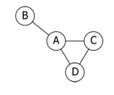
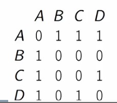
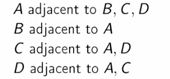
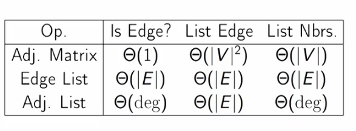

## Graphs Basics

Simple Graph is a graph with no self loops and multiple edges b/w a pair of vertices.

## Representation Graphs

### Edge List 

- List of all the edges 
- (A,B) , (A,C), (A,D),(C,D)

### Adjacency Matrix

- Matrix : entries 1 if there is an edge and 0 if there is not.

  

### Adjacency Matrix

- for each vertex, a list of adjacent neighbors
- 

### Complexity

**Graph algorithm runtime depends on |V| and |E|.**

In **dense graph** $$|E| \approx |V^2|$$

In **sparse graph** $$|E| \approx |V|$$, social network, or route graphs.

