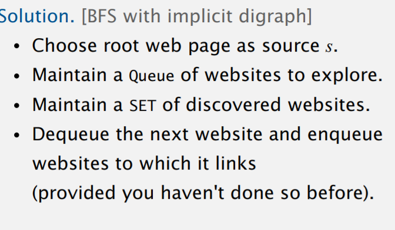
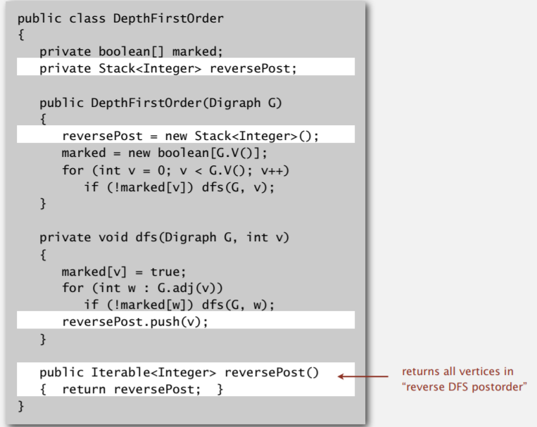

# Data Structures

- Graphs
- suffix Trees
- suffix arrays
- union find

# Algorithms

- KMP
- RK
- Fast Dijkstra 
- Weighted union find with path compression WUFPC
- FFT

##KosaRaju-Shamir 

### STRING

Manchester Algorithm : find longest palindrome substring in O(n)

# Problems

- 2 Sum
- 3 Sum
- n the element in a single linked list 
  - use currr and follower two pointer
    - first move curr to n step
    - then move curr and follower synchronously to the end of list
    - return follower
- Coin Change : given an input x and a coins array determine minim coins to exchange X
  - think recursively    1+ min( change(n-x)) for all  x in coins  (exponential complexity)
  - check overflows and base cases
  -  use DP to speed up O(n^2)
- kth smallest/largest element in unsorted array
  - Sort the Array then  return element at K index. O(n *log n)
  - Make a min heap of array and remove K element to get kth smallest  O(n + k log n)
    - O(n) algorithm exists for min heap creation algorithm
  - Quick-Find:- Quick Sort only the partition which has kth element part
    - O(n) run average , O(n^2) worst case
- median of running array
- where to use merge sort vs quicksort
- **median of 2 sorted arrays**
- FSA simulation
- 3 way quick sort
- longest diameter of a graph
- **Manacher  algorithms : Longest Palindromic substring (HARD)**  O(n)
  - nicely explained here:
  - Key notes:
    - Totally contained under current palindrome. (skip)
    - Current palindrome expands till end of the input(skip)
    - Palindrome expands till right edge & mirror palindrome is prefix (explore it)
    - Palindrome expands till right edge and mirror expands beyond left edge. (skip)
  - 

## Graph

### Undirected Graph
- **graph is bipartite or not** 
  - solution : using DFS (how ?)

- **graph contains a cycle or not**

  - solution : using DFS

- **graph has Euler tour Is there a cycle that uses each edge exactly once?**
  - property a  connected graph is Eulerian iff all vertices have even degree.

- **find a cycle that visit every vertex exactly once, Travelling salesman problem Hamiltonian cycle problem.**
  - are two graph identical except for names ? Graph Isomorphism problem
  - *No one knows how to classify this problem.*
- **planar graph problem such that no edge cross each other.**
  - algorithm exist linear time DFS based planarity algorithm (Complex Algorithm).

### Directed Graph

#### DFS

- Application 
  -  program control-flow analysis
  -  mark-sweep garbage collector
    - find the object that are not reachable by program and delete them.
  -  Topological Sort..
  -  Path Finding.
  -  **Directed cycle Detection**
     -  A digraph has a topological order iff no directed cycle.
     -  If directed cycle, topological order impossible.
        ・If no directed cycle, DFS-based algorithm finds a topological order.
  -  java compiler uses cycle to detect cyclic inheritance.
- Difficult Application
  - 2-satisfiablity
  - Directed Euler Path
  - **Strongly connected components.**
    - Def. Vertices v and w are strongly connected if there is both a directed path
      from v to w and a directed path from w to v
    - Property strongly connection is **equivalence relation.**
    - Kosaraju Linear-Time algorithms

#### BFS

 - **Multiple-source shortest paths.** 
    - Given a digraph and a set of source vertices, find shortest path from any vertex in the set to each other vertex. 
    - Use BFS but initialize by enqueuing all source vertices.
 - **Web Crawler**
   - Goal. Crawl web, starting from some root web page, say www.princeton.edu.

- **Precedence scheduling**

  - Goal. Given a set of tasks to be completed with precedence constraints,
    in which order should we schedule the tasks?
  - Works only on Directed Acyclic Graph DAG.
  - Topological sort.
    - Run depth first search
    - Return vertices in reverse post-order.

